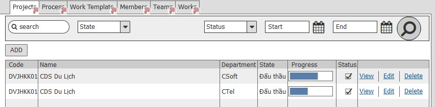
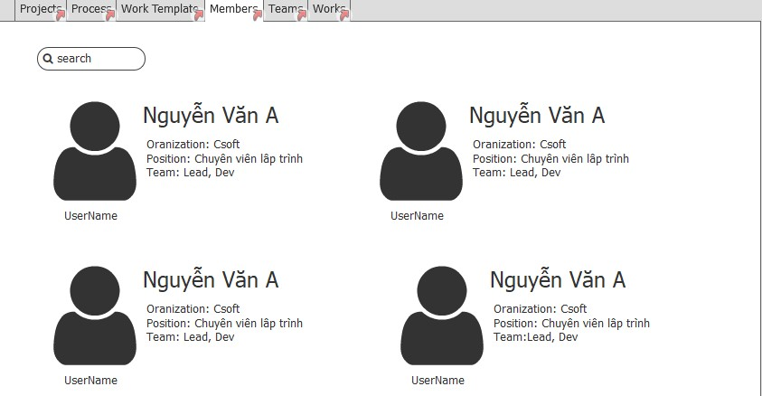

# Yêu cầu nghiệp vụ
 - Quan lý danh sách thông tin phòng ban trong công ty 
 - Cho phép thêm sửa xóa phòng ban trên hệ thống 
 - Cho phép đồng bộ phòng ban từ hệ thống HRM  

## Chức năng danh sách phòng ban

### Thông tin danh sách phòng ban
| Tên trương | Kiểu dữ liêu | Bắt buộc | Giá trị | Mô tả|
| --- | --- | --- | --- | --- |
| Thông tin phòng ban|
| Tên phòng ban |  | * |
| Trưởng phòng| | *| 
| Số điện thoại|  |  |
|Email:
### Giao diện
NA
## Chức năng thêm mới phòng ban
### Mô tả các trường thông tin 
| Người thực hiên: | Người dùng |
| Tên trương | Kiểu dữ liêu | Bắt buộc | Giá trị | Mô tả|
| --- | --- | --- | --- | --- |
| Tên phòng ban: |
| Mã phòng ban | Text | * |
| Dự án | | |  | Tab gồm danh sách dự án trong phòng ban
| Thành viên | List | | | List danh sách thành viên phòng ban|

### Giao diện

# Yêu cầu kỹ thuật

## Quản lý phòng ban

- Đồng bộ phòng ban với HRM\(Nhờ Lực support\)
- Danh sách phòng ban
- Màn hình detail\(danh sách nhóm, danh sách dự án\)
- Control chọn phòng ban cho các chức năng khác có các thuộc tính
	- Root - phòng ban của user hiện tại
	- Scope - Phạm vi lấy phòng ban
	- Types - Danh sách loại đơn vị được chọn
	- Levels - Các cấp đơn vị được chọn
	- IsMulti - Có cho phép chọn nhiều
> Các thuộc tính của control có thể tủy chỉnh tùy theo dữ liệu đồng bộ về

## Quản lý nhóm
- CRUD Nhóm
- Nhóm phải thuộc phòng ban
- Các thành viên trong nhóm có thể là thành viện trong phòng ban hoạc thuộc các đơn vị con
- Control chon nhóm tương tự như control chọn phòng ban
- Màn hình detail\(Có danh sách thành viên, danh sách dự án, danh sách công việc\)

 # Quay lại
 [Sprint SRS](../Index.md#sprint-1)