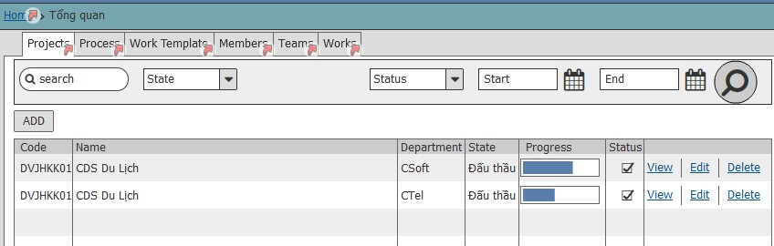
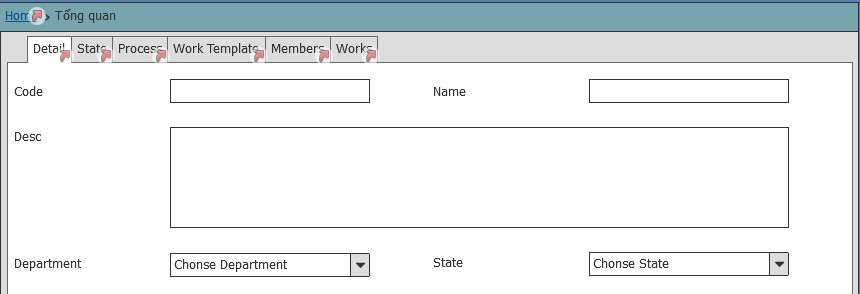
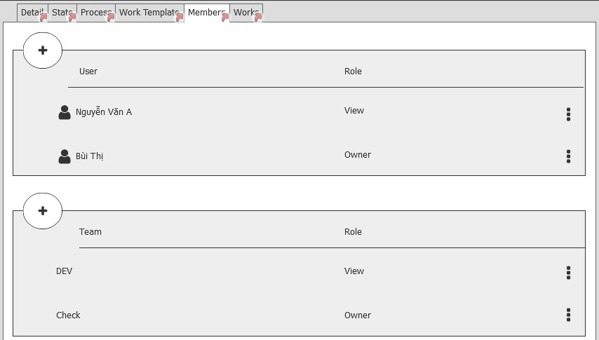
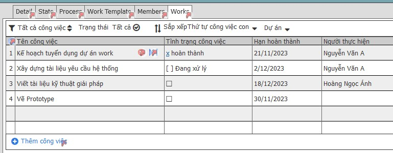

# Yêu cầu nghiệp vụ
 - Quản lý các dự án của công ty có thể đồng bộ từ hệ thống PMS hoặc tạo các dự án muốn quản lý 
 - Cho phép thêm, sủa, xóa dự án
 - Cho phép đồng bộ dự án đã lập từ hệ thống PMS
  - Các dự án lập trên work và các công việc chưa giao cho người khác làm mới được xóa, còn lại chỉ được phép dừng hoạt động
 - Dự án dừng hoạt động các công việc đang thực hiện yêu cầu kết thúc trạng thái mới được dừng
 - Có 2 loại dự án : Không phải đấu thấu và phải đấu thầu
 bao gồm
## Danh sách role dự án
 - AM
 - Chỉ đạo trực tiếp:
 - Presale manager
 - Phê duyệt giá
 - PMO
 - Phê duyệt khởi tạo:
 - Trưởng nhóm  
## Danh sách giai đoạn dự án
Loại dự án đấu thấu bao gồm: 
   -Khởi tạo dự án 
  - Tiền đấu thầu 
  - Đấu thầu 
  - Đàm phán hợp đồng 
  - Kí kết hợp đồng 
  - Triển khai dự án 
  - Hỗ trợ kỹ thuật 
  - Đóng dự án 
 Loại dự án không đấu thầu
 -Khởi tạo dự án 
 - Đàm phán hợp đồng 
 - Kí kết hợp đồng 
 - Triển khai dự án 
 - Hỗ trợ kỹ thuật 
 - Đóng dự án 

## Chức năng danh sách dự án
### Thông tin danh sách dự án

| Tên trương | Kiểu dữ liêu | Bắt buộc | Giá trị | Mô tả|
| --- | --- | --- | --- | --- |
| Mã dự án|
| Tên dự án| Textview |  |
| Giai đoạn dự án |  | |  | Theo giai đoạn hiện tại của dự án|
| Tiến độ dự án Text | % | | | Tiến độ dự án được bao nhiêu %|
|Thao tác: | | | | View, edit, delete |
### Giao diện

## Chức năng thêm mới dự án
|  | Mô tả |
| --- | --- |
| Người thực hiên: | Người dùng |

### Yêu cầu chung:
 - Dự án thêm mới ở trên đầu trang

### Mô tả các trường thông tin
| Tên trương | Kiểu dữ liêu | Bắt buộc | Giá trị | Mô tả|
| --- | --- | --- | --- | --- |
| Thông tin dự án: |
| Tên dự án | Text | * |
| Mã dự án | | *| 
| Thuộc phòng ban | Droplist | *| | List phòng ban lấy theo scope của user trong phần quyền user để tạo dự án|
| Mô tả | Text | 
| Giai đoạn dự án: | Addlist|  | | Lấy từ danh mục giai đoạn dự án|
| Thành viên dự án: |
| Tên thành viên | Add list| *| | Thành viên lấy theo phạm vi phòng ban của dự án đã chọn |
| Vai trò | Add list| * |
| Tên team tham gia dự án| Add list|  |
| Vai trò Team | Add list|  |
| Danh sách công việc dự án: |
| Tên công việc | | | | -Tên công việc đang làm của dự án|
| Trạng thái công việc| | | | -Trạng thái xử lý của công việc|
| Hạn hoàn thành | date | 
| Người thực hiện| | | | -Người được giao việc|
### Giao diện

# Yêu cầu kỹ thuật
## Quản lý giai đoạn dự án
- CRUD giai đoạn
- Có trường map với gia đoạn PMS để đồng bộ với PMS
- Dataseed tạo sẵn dữ liệu giai đoạn theo các giai đoạn của PMS và đánh dấu không được xóa

## Quản lý vai trò trong dự án

- CRUD các vai trò trong dự án
- Có trường để Map với vai trò bên PMS

## Quản lý dự án
- Thêm dự án: Nhập mã dự án và đồng bộ từ PMS về
	- Tùy theo loại dự án để tự gán các giai đoạn dự án vào(hardcode theo dataseed tạo bên trên)
	- Động bộ danh sách thành viên
- Cho phép sửa tên hiện thị của các giai đoạn dự án
- Thêm thành viên vào dự án
- Thêm nhóm vào dư án
- Detail dự án(Danh sách giai đoạn, danh sách thành viên(Team), danh sách công việc)

 # Quay lại
 [Sprint SRS](../Index.md#sprint-1)