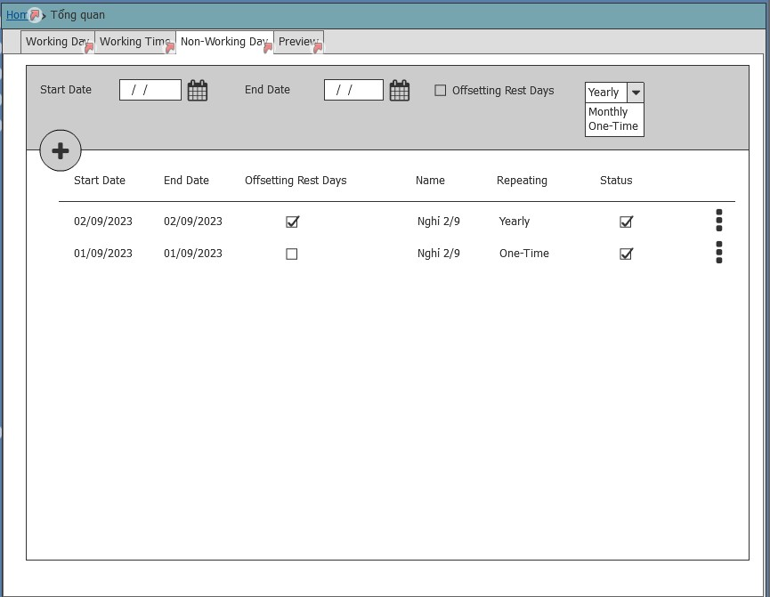

# Yêu cầu nghiệp vụ
 - Cho phép cấu hình ngày nghỉ, ngày làm việc trong tuần áp dụng trên hệ thống
 - Cho phép chọn thứ trong tuần và cấu hình giờ làm việc của ngày đó. VD t7 làm nửa này
  Cấu hình ngày nghỉ lễ trong năm

## Chức năng Cấu hình ngày nghỉ, ngày làm việc trong tuần
### Mô tả các trường thông tin
| Tên trương | Kiểu dữ liêu | Bắt buộc | Giá trị | Mô tả|
| --- | --- | --- | --- | --- |
| Ngày trong tuần| Datetime| *| | Chọn các thứ làm việc trong tuần |
| Thời gian làm việc| Time | * | | Chọn thời gian bắt đầu và kết thúc trong ngày|
| On/Off | | *| 

### Giao diện

## Chức năng cấu hình ngày nghỉ lễ
### Mô tả các trường thông tin
| Tên trương | Kiểu dữ liêu | Bắt buộc | Giá trị | Mô tả|
| --- | --- | --- | --- | --- |
| Ngày bắt đầu: | Datetime|
| Ngày kết thúc| Datedime | * |
|Mô tả|

### Giao diện

# Yêu cầu kỹ thuật
-

 # Quay lại
 [Sprint SRS](../Index.md#sprint-1)