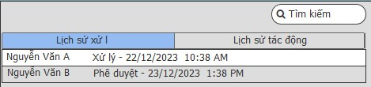

# Yêu cầu nghiệp vụ
 - Cho phép thêm sửa xóa một công việc cần thực hiện 
 - Công việc chưa phân sẽ được nằm ở danh sách công việc chưa phân
 - Công việc sẽ được phân cho 1 người xử lý và nhiều người liên quan có thể tham gia bình luận, trao đổi, hỗ trợ
 - Tạo công việc con nếu có công việc liên quan tới người khác và có thể gán người xử lý cho công việc con đó
 - Tổng các công việc con hoàn thành thì công việc cha sẽ hoàn thành(trường hợp chọn công việc con phụ thuộc vào công việc cha)
 - Cho phép phân công công việc cho người khác
 - Công việc yêu cầu phê duyệt 2 bước sẽ chọn thêm người phê duyệt(2 người phê duyệt mới tính là done)

## Chức năng thêm mới công việc
### Yêu cầu chung

### Mô tả các trường thông tin
| Tên trương | Kiểu dữ liêu | Bắt buộc | Giá trị | Mô tả|
| --- | --- | --- | --- | --- |
| Thông tin công việc: |
| Tên công việc| Text | * |
| Mã công việc | | *| 
| Mã đầu việc | | *|  | Lấy tại danh mục đầu việc|
| Mô tả | Text | 
|Thông tin giao việc:|
|Người thực hiện| | | | Lấy từ danh sách nhân viên|
|Người kiểm tra| | | | Lấy từ danh sách nhân viên|
|Người giao việc| | | | Tên acc giao việc|
|Ngày bắt đầu|Datetime | | | Mặc định ngày giao việc, có thể sửa |
|Hạn hoàn thành| Datetime | | | |
|Mức độ ưu tiên| Droplist | | | lấy từ danh mục |
|Mức độ quan trọng| Droplist| | | lấy từ danh mục |
|Mục tiêu| checkbox | |  |Thêm mới các mục tiêu trong công việc|
|Bình luận| | | | Người liên quan tới công việc sẽ được bình luận 
|Công việc con| List| | | Mở popup thêm mới và hiển thị dạng list |
|Tài liệu| | |  | Attack tài liệu liên quan tới công việc kèm theo   Hiển thị theo dạnh dang sách|
|Timeline| | | | - Tab nhật ký xử lý công việc: ai phân công, ai xử lý ai phê duyêt.. vào ngày giờ   - Tab nhật ký tác đông vào công việc: các tác động như xóa, sửa vào ngày giờ...
|Thời gian thực hiện| | | | -Nếu làm xong sớm có thể log thời gian làm thực tế vào  - Trường hợp hoàn thành công việc hệ thống sẽ tự động lấy ngày, giờ kết thúc- giờ băt đầu = thời gian thực hiện|
|Người liên quan| | | | Mở popup Add danh sách người liên quan tới công việc|
|Nhắc việc| | | | Cho phép công việc có nhắc lại hay không, vào thời gian nào |
|Công việc lặp lại| | | | Cho phép công việc có lặp lại theo chu kỳ: hàng ngày, hàng tuần(thứ mấy), hàng tháng(giao diện như cấu hình gưi email tự động)|
|Phê duyệt| | | | Công việc cần bước phê duyệt sẽ add người phê duyệt vào |
### Giao diện
Thêm mới cv

Timeline:

 

# Yêu cầu kỹ thuật
-

 # Quay lại
 [Sprint SRS](../Index.md#sprint-1)