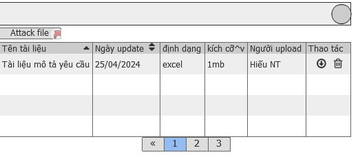

# Yêu cầu nghiệp vụ
 - Cho phép attack tài liệu liên quan tới công việc vào và hiển thị theo danh sách
 - Tài liệu nào update mới nhất sẽ lên đầu trang
 - Người liên quan tới công việc sẽ được download tài liệu và update tài liệu
 - Lưu được lịch sử update tài liệu(nguồi có quyền owner mới xóa được tài liệu)

## Chức năng cấu hình phê duyệt 2 bước
### Yêu cầu chung
 - Quản lý được danh sách tài liệu của công việc

### Giao diện

# Yêu cầu kỹ thuật
-

 # Quay lại
 [Sprint SRS](../Index.md#sprint-1)