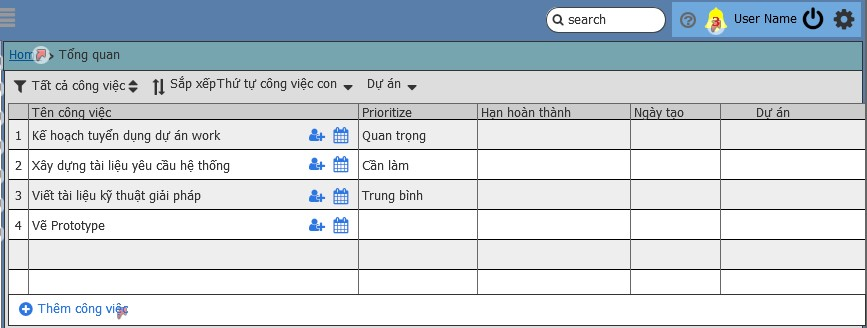

# Yêu cầu nghiệp vụ
 - Cho phép thêm sửa xóa một công việc cần thực hiện 
 - Công việc chưa phân sẽ được nằm ở danh sách công việc chưa phân
 - Công việc sẽ được phân cho 1 người xử lý và nhiều người liên quan có thể tham gia bình luận, trao đổi, hỗ trợ
 - Tạo công việc con nếu có công việc liên quan tới người khác và có thể gán người xử lý cho công việc con đó
 - Tổng các công việc con hoàn thành thì công việc cha sẽ hoàn thành(trường hợp chọn công việc con phụ thuộc vào công việc cha)
 - Cho phép phân công công việc cho người khác
 - Công việc yêu cầu phê duyệt 2 bước sẽ chọn thêm người phê duyệt(2 người phê duyệt mới tính là done)

## Chức năng danh sách công việc chưa phân
### Mô tả các trường thông tin
| Tên trương | Kiểu dữ liêu | Bắt buộc | Giá trị | Mô tả|
| --- | --- | --- | --- | --- |
| Thông tin công việc|
| Tên công việc | Text | * |
| Độ quan trọng | | *| 
| Hạn hoàn thành | | *| 
| Ngày tạo| | *| 
| Dự án| | *| 
### Giao diện

# Yêu cầu kỹ thuật
-

 # Quay lại
 [Sprint SRS](../Index.md#sprint-1)