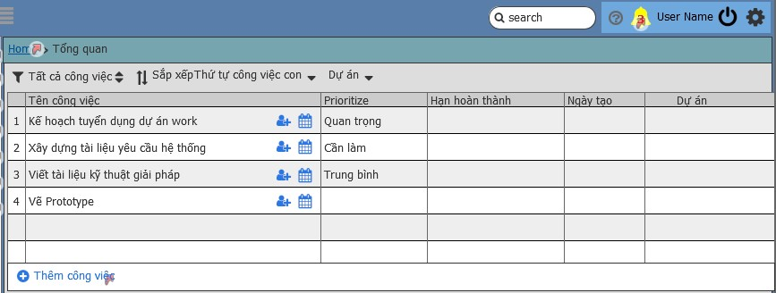

# Yêu cầu nghiệp vụ

 - Cho phép thêm sửa xóa một công việc cần thực hiện 
 - Công việc chưa phân sẽ được nằm ở danh sách công việc chưa phân

## Chức năng danh sách công việc chưa phân
### Mô tả các trường thông tin
| Tên trương | Kiểu dữ liêu | Bắt buộc | Giá trị | Mô tả|
| --- | --- | --- | --- | --- |
| Thông tin công việc|
| Tên công việc | Text | * |
| Độ quan trọng | | *| 
| Hạn hoàn thành | | *| 
| Ngày tạo| | *| 
| Dự án| | *| 
### Giao diện

# Yêu cầu kỹ thuật
-

 # Quay lại
 [Sprint SRS](../Index.md#sprint-1)